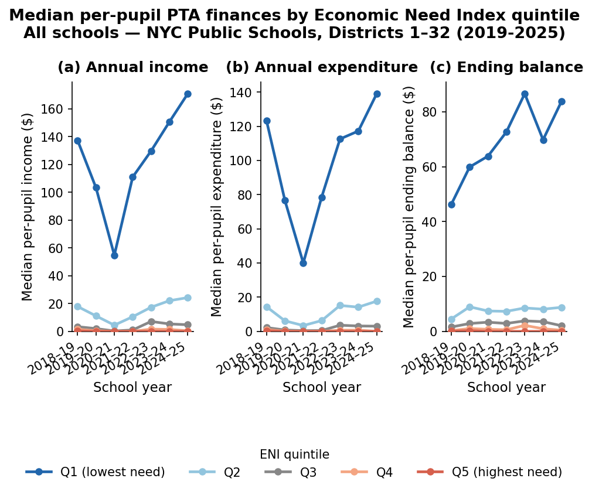

---
format:
    pdf:
        geometry:
            - margin=1in
---

# NYC PTA Funding Analysis

In this project, I analyzed Parent Teacher Association (PTA) fundraising and expenditure data
across New York City Public Schools (NYCPS), which were made available by the transparency
mandates of Local Law 171 of 2018. While public schools are primarily funded through the
city’s equity- and needs-based Fair Student Funding (FSF) formula, private PTA contributions remain
largely opaque and in some cases, incredibly unequal. These stark inequities
create funding gaps that closely mirror socioeconomic and racial segregation.

## Key results

### Severe financial inequities

As expected, PTA funding is hyper-concentrated.

In 2024-25, the median PTA per-pupil expenditure was just $19. However, the 95th percentile school spent $471 per-pupil,
the 99th jumped to $1,293, and the highest spending school spent $2,738 for each enrolled student.

<!-- for GitHub README -->

 -->

<!-- for PDF rendering with Quarto -->

<!-- {width=80%}
\newline
\par
{width=80%} -->

In the wealthiest schools, this expenditure acted almost as like a "shadow budget." For example, schools like P.S. 029 John M. Harrigan and P.S. 158 Bayard Taylor spent private PTA funds worth 25% and 23% of their entire public FSF allocation, respectively.

### Socioeconomic and demographic stratification

As expected, schools serving students with more economic need tend to have PTAs that spend less.

There is a clear negative linear relationship (OLS slope = -6.81) between students' economic need
(measured by the NYCPS-created Economic Need Index, or ENI) and (the log of) PTA funding:

<!-- {width=80% fig-pos="H"} -->

Schools in the highest PTA expenditure quantile have a drastically higher share of White and Asian students compared to the lowest quantile, which is predominantly composed of Hispanic and Black students.

<!-- {width=80% fig-pos="H"} -->

### Increasing inequity over time

As demonstrated below, the gap between the top 20% of schools and the bottom 80% is stark and is widening.
And although PTA incomes and expenditures for the top quintile of schools dipped sharply during the pandemic,
their _ending balances_—i.e., the money that the PTA carries over year-to-year—continued to steadily increase.

<!-- {fig-pos="H"} -->

### Data anomalies

The publicly available PTA fundraising data had a substantial number of accounting anomalies, like

- Cross-year discrepancies between ending balances in Y0 and starting balances in Y1.
- Within-year discrepancies between the implied ending balance (`starting balance + income - expenditures`), and the reported ending balance.
- Accounting errors like values expressed in cents rather than dollars.

In particular, the cross-year balance discrepancies - where the previous year's ending balance differed from the starting balance by over $50,000* - were highly concentrated in the schools with the wealthiest PTAs. This may warrant further investigation to see if these errors are happening systematically or intentionally.
*TODO: make this a dynamic threshold- where the flag is based on the percent discrepancy from the end or start balance

<!-- {width=80% fig-pos="H"}
\newline
\par
{width=80% fig-pos="H"} -->

## AI Use Disclaimer

This project was developed with assistance from Claude. Particularly,

- Initial conversations with Claude helped shape the research question, data architecture, and analytical approach, including the identification of methodological considerations like the treatment of missing vs. inactive PTA records.
- Claude also flagged several data quality issues during exploratory analysis, including an anomalous expenditure value that prompted a broader audit of balance sheet consistency. The systematic diagnosis and correction of scaling errors in PTA financials was developed collaboratively.
- Claude helped me scaffold analytical code, especially for the data visualization module. All generated code was reviewed, tested, and modified by myself before use.
- Finally, Claude provided feedback on descriptive outputs and figures during the exploratory analysis phase, helping prioritize which findings to foreground.
