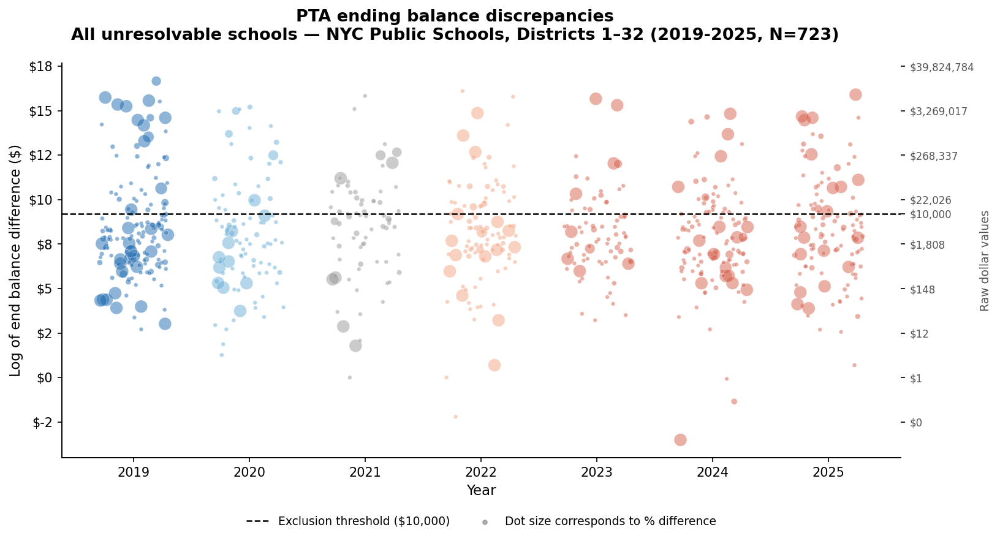
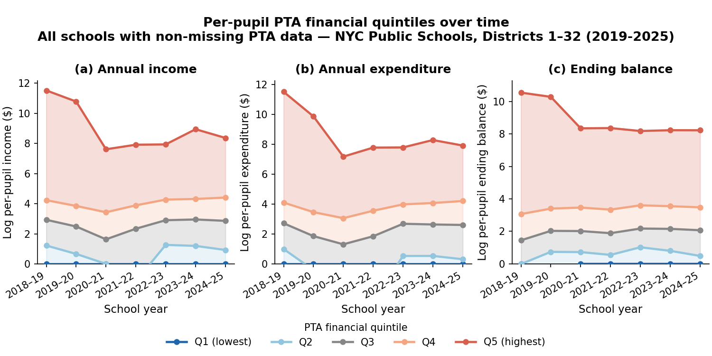
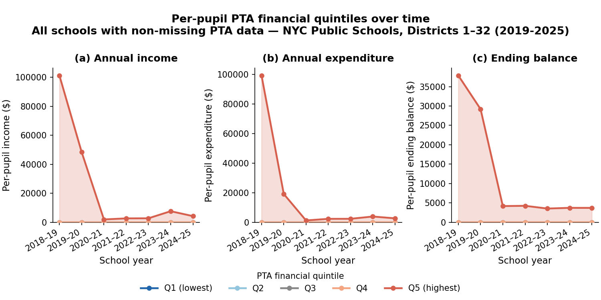

<!-- ---
format:
    pdf:
        geometry:
            - margin=1in
--- -->

# Private Money, Public Inequality: PTA Funding in NYC Schools

In this project, I analyzed Parent Teacher Association (PTA) fundraising and expenditure data
across New York City Public Schools (NYCPS), which were made available by the transparency
mandates of Local Law 171 of 2018. While public schools are primarily funded through the
city’s equity- and needs-based Fair Student Funding (FSF) formula, private PTA contributions remain
largely opaque and in some cases, incredibly unequal. These stark inequities
may exacerbate funding gaps that mirror socioeconomic and racial segregation.

## Table of Contents

- [Key findings](#key-findings)
- [Background](#background)
    - [Landscape of school funding in NYC](#landscape-of-school-funding-in-nyc)
    - [Analytical sample](#analytical-sample)
- [Results](#results)
    - [Missingness in PTA reporting](#missingness-in-pta-reporting)
    - [Severe financial inequities](#severe-financial-inequities)
    - [Socioeconomic & demographic stratification](#socioeconomic-and-demographic-stratification)
    - [Increasing inequity over time](#increasing-inequity-over-time)
- [Data anomalies](#data-anomalies)
- [AI Use Disclaimer](#ai-use-disclaimer)

## Key findings

- **Data quality.** There is a substantial amount of missingness and a number of discrepancies in reporting that should be further investigated. 
- **Severe financial inequities.** PTA expenditure is extremely unequal and hyper-concentrated. While median per-pupil spending is minimal, the top schools spend orders of magnitude more.
- **Socioeconomic stratification.** Schools serving more students with economic need receive and spend substantially less in PTA funds, reinforcing disparities in discretionary resources. (Caveat: higher-need schools receive more public funding.)
- **Demographic stratification.** PTA expenditure is strongly stratified by race, with higher-spending schools serving disproportionately more White and Asian students.
- **Increasing inequities.** Inequities are increasing over time, with the top 20% seemingly accumulating wealth year-over-year. 

## Background

### Landscape of school funding in NYC

NYC public schools draw on several distinct funding streams:

- The primary source of public funding is the **Fair Student Funding (FSF) formula**, an equity- and needs-based allocation system that provides schools with discretionary dollars for foundational and instructional costs (e.g., staffing, educational programming, supplies and technology, and general costs).
- The other public funding source is **non-FSF allocations**, which fall into three categories:
    - federal and state categorical funds restricted to specific student populations (e.g., Title I for low-income students, Title III for English Language Learners),
    - city programmatic funding for targeted grants and city-mandated initiatives like pre-K expansion, and
    - central and ancillary costs for system-wide services like transportation, custodial maintenance, and school safety.
- Finally, schools can raise and spend private dollars through their **Parent Teacher Associations** (PTAs). PTA financial data — including starting balances, annual income, expenditures, and ending balances — was made available through the transparency mandates of Local Law 171 of 2018, seven years of data (2018-19 through 2024-25).

Since PTA fundraising has historically been an opaque funding source, this analysis uses this publicly available data to examine whether private contributions compound the inequities that public funding is designed to address.

### Goals of this analysis 

Inequities in NYC PTA fundraising and expenditures are widely recognized (see: [this Chalkbeat article](https://www.chalkbeat.org/newyork/2026/05/15/disparities-in-nyc-pta-parent-school-fundraising/)), but a deep and systematic characterization of the data has yet to be published. This analysis aims to investigate the following questions: 

- **Data quality**: Can we trust the publicly reported PTA data?
- **Extent of inequities**: How inequitable is PTA spending? Is it stratified by student characteristics? (e.g., economic need, race/ethnicity)
- **Context relative to public dollars**: Is PTA fundraising offsetting the progressive intent of FSF and non-FSF allocations?
- **Trends over time**: Are inequities increasing over time?

### Data quality 

#### Missingness in PTA reporting 

In the reported NYCPS PTA financial data, I identified three distinct categories of schools for the 2024-25 school year (N=1,454):

- Active PTAs (n=831): Schools reporting non-zero values for start balance, income, expenditure, or end balance.
- Inactive PTAs (n=301): Schools reporting consistent zero values across all financial fields.
- Missing Data (n=322): Schools with null entries across all financial fields.

Analysis of the Economic Need Index (ENI) reveals systematic differences between these groups, suggesting that "missing" PTAs is not equivalent to "inactive" PTAs. Specifically:

- the mean ENI for schools with active PTAs is 0.74,
- the mean ENI for schools with inactive PTAs is 0.90, and
- the mean ENI for schools with missing PTA data is 0.81.

Because schools with missing data fall between active and inactive schools in terms of ENI, we conclude that imputing missing values as zero would introduce significant bias. Further investigation is needed to determine potential causes of missingness, and to rule out systematic non-reporting of PTA data. For now, all analyses for the 2024-25 school year exclude the 322 schools with missing data.

#### Ending balance discrepancies

There were also a large number of observations where the _implied_ ending balance (starting balance + income - expenditures) differed substantially from the _reported_ ending balance. For example, for P.S. 133 Wiliam A Butler: 

| Starting Balance | Income         | Expenditures     | Implied Ending Balance | Reported Ending Balance |
| :--------------: | :------------: | :--------------: | :--------------------: | :---------------------: |
| $308,365.75      | $412,912.97    | $128,048.85      | $593,229.87            | $104,547.22             |

This constitutes a difference of $488,682.65! This was an especially egregious, cherry-picked example, but it is indicative of a larger pattern in the data. Out of the 10,321 observations in the seven years of reporting, 

- 67% had implied end balances that were within 5% of the reported end balance, and
- 33% exceeded 5% of the end balance.

On manual inspection, I found that there were many observations where the amount for one column was expressed in _cents_ rather than _dollars_. I was able to bring 79% of the anomalous observations within 5% of the reported end balance by dividing one of the starting baalnce, income, or expenditure by 100—but 7% (n=723) of the total observations were unresolvable. 

However, although all 7% of the discrepancies exceeded 5% of the reported value, a majority of them represented relatively _small_ dollar amounts: 

 

Therefore, in the final analytical sample, I removed only those observations (36 schools in 2024-25, 214 schools overall) where the discrepancy exceeded both: 

- 5% of the reported end balance, AND
- an absolute value of $10,000.

#### Other data quality issues 

Other data quality issues include year-over-year discrepancies in end-to-start balances. For example, in 2023-24, Stuyvesant High School had an _ending balance_ of $1,319,236.00; in 2024-25, they had a _starting balance_ of just $12,001.77. Where did the rest of the $1,307,234.23 go? 

Finally, there were very high values in the first year of reporting that mysteriously disappeared...

 

Without taking the log of the y-axis...

 

Further investigation is needed to identify the cause of these discrepancies. 

### Final analytic sample

- The analysis is restricted to schools in Districts 1–32, the general education community school districts, and excludes District 75 (specialized schools for students with disabilities) and District 79 (alternative programs).
- Additionally, to ensure complete covariate coverage, the sample is further limited to schools appearing in all three source datasets in a given year: the NYCPS Demographic Snapshot, the Fair Student Funding allocations file, and the PTA fundraising data.
- I also removed the 1,965 observations with missing PTA data (322 schools in the 2024 SY).
- Lastly, I removed 214 observations with substantial ending balance discrepancies (36 schools in 2024-25).

The final sample was comprised of 8,142 total observations, with 1,122 schools in the 2024-25 SY. 

## Analytical results

### Severe financial inequities

As expected, PTA funding is hyper-concentrated.

In 2024-25, the median PTA per-pupil expenditure among all schools (with non-missing PTA data) was just $6.
(Among only schools with active PTAs, the median expenditure was $18 per student.)
Yet the 95th percentile school spent $350 per-pupil, the 99th spent $1,188, and the highest spending school spent $2,738 for each enrolled student—translating to nearly $2 million in total expenditures.

<!-- for GitHub README -->

 

<!-- for PDF rendering with Quarto -->

<!-- {width=80%}
\newline
\par
{width=80%} -->

In the schools with the wealthiest PTAs, this expenditure acted almost as like a "shadow budget." For example:

- The top school, P.S. 029 John M. Harrigan, spent $1,944,016 (25% of its FSF allocations, and 17% of its total public dollars).
- The second-to-top school, P.S. 158 Bayard Taylor, spent $1,512,642 (23% of its FSF allocations, and 14% of its public dollars).

### Socioeconomic and demographic stratification

As expected, schools serving students with more economic need tend to have PTAs that spend less.

There is a clear negative linear relationship (OLS slope = -6.81) between students' economic need
(measured by the NYCPS-created Economic Need Index, or ENI) and (the log of) PTA funding:

<!-- {width=80% fig-pos="H"} -->

Schools in the highest PTA expenditure quantile have a drastically higher share of White and Asian students compared to the lowest quantile, which is predominantly composed of Hispanic and Black students.

Among schools in the highest quintile (by per-pupil PTA expenditure), 60% of students were White or Asian and 33% were Black or Hispanic. However, among schools in the lowest quintile, just 15% were White or Asian, and 82% were Black or Hispanic.

<!-- {width=80% fig-pos="H"} -->

#### Caveat: comparison with total funding amounts

An important caveat to note is that generally, schools with greater need (serving students with more economic need, in greater need of special education services, etc.) receive _more_ in public funding (both in Fair Student Funding allocations and non-FSF allocations):

 

Additionally, _even including PTA expenditures_, schools in the lowest economic need quintile (Q1) receive less in total funding (FSF allocations + non-FSF allocations + PTA expenditures) compared to those in the higher quintiles:

This indicates that PTA expenditures do not fully offset the redistributive design of public school funding: schools in the lowest-need quintile (Q1) still receive less in total funding than higher-need quintiles even after PTA dollars are included. However, as alluded to above, among the schools with the highest PTA expenditures, PTA dollars can comprise a significant share of total funding amounts—which may work against the equity imperative that public dollars are intended to enforce.

### Increasing inequity over time

As demonstrated below, the gap between the 20% of schools with the lowest economic need (Q1) and the remaining 80% (Q2-Q5) is stark and is widening.
And although PTA incomes and expenditures for the top quintile of schools by ENI dipped sharply during the pandemic, their _ending balances_—i.e., the money that the PTA carries over year-to-year—continued to steadily increase, suggesting that these PTAs are _accumulating_ wealth over time.

<!-- {fig-pos="H"} -->

## AI Use Disclaimer

This project was developed with assistance from Claude. Particularly,

- Initial conversations with Claude helped shape the research question, data architecture, and analytical approach, including the identification of methodological considerations like the treatment of missing vs. inactive PTA records.
- Claude also flagged several data quality issues during exploratory analysis, including an anomalous expenditure value that prompted a broader audit of balance sheet consistency. The systematic diagnosis and correction of scaling errors in PTA financials was developed collaboratively.
- Claude helped me scaffold analytical code, especially for the data visualization module. All generated code was reviewed, tested, and modified by myself before use.
- Finally, Claude provided feedback on descriptive outputs and figures during the exploratory analysis phase, helping prioritize which findings to foreground.
