<!-- ---
format:
    pdf:
        geometry:
            - margin=1in
--- -->

# NYC PTA Funding Analysis

In this project, I analyzed Parent Teacher Association (PTA) fundraising and expenditure data
across New York City Public Schools (NYCPS), which were made available by the transparency
mandates of Local Law 171 of 2018. While public schools are primarily funded through the
city’s equity- and needs-based Fair Student Funding (FSF) formula, private PTA contributions remain
largely opaque and in some cases, incredibly unequal. These stark inequities
may exacerbate funding gaps that mirror socioeconomic and racial segregation.

## Table of Contents

- [Key Findings](#key-findings)
- [Background](#background)
    - [Landscape of school funding in NYC](#landscape-of-school-funding-in-nyc)
    - [Analytical sample](#analytical-sample)
- [Results](#results)
    - [Missingness in PTA reporting](#missingness-in-pta-reporting)
    - [Severe financial inequities](#severe-financial-inequities)
    - [Socioeconomic & demographic stratification](#socioeconomic-and-demographic-stratification)
    - [Increasing inequity over time](#increasing-inequity-over-time)
- [Data anomalies](#data-anomalies)
- [AI Use Disclaimer](#ai-use-disclaimer)

## Key findings

- **Missingness in PTA reporting.** There is a substantial amount of missingness in the PTA fundraising data, which warrants further investigation.
- **Severe financial inequities.** PTA expenditure is extremely unequal and hyper-concentrated towards the top spenders.
- **Socioeconomic stratification.** Higher-need schools spend less in PTA funds. (Caveat: they also receive more in public funds.)
- **Demographic stratification.** PTA expenditure is strongly stratified by race.
- **Increasing inequities.** Inequality is increasing over time.
- **Data anomalies.** There are a substantial number of anomalies in the PTA fundraising data that warrant further investigation.

## Background

### Landscape of school funding in NYC

NYC public schools draw on several district funding streams:

- The primary source of public funding is the Fair Student Funding (FSF) formula, an equity- and needs-based allocation system that provides schools with discretionary dollars for foundational and instructional costs (e.g., staffing, educational programming, supplies and technology, and general costs).
- The other public funding source is non-FSF allocations, which fall into three categories:
    - federal and state categorical funds restricted to specific student populations (e.g., Title I for low-income students, Title III for English Language Learners),
    - city programmatic funding for targeted grants and city-mandated initiatives like pre-K expansion, and
    - central and ancillary costs for system-wide services like transportation, custodial maintenance, and school safety.
- Finally, schools can raise and spend private dollars through their Parent Teacher Associations (PTAs). PTA financial data — including starting balances, annual income, expenditures, and ending balances — was made available through the transparency mandates of Local Law 171 of 2018, covering school years 2018-19 through 2024-25.

Since PTA fundraising has historically been an opaque funding source, this analysis uses this publicly available data to examine whether private contributions compound the inequities that public funding is designed to address.

### Analytical sample

- The analysis is restricted to schools in Districts 1–32, the general education community school districts, and excludes District 75 (specialized schools for students with disabilities) and District 79 (alternative programs).
- Additionally, to ensure complete covariate coverage, the sample is further limited to schools appearing in all three source datasets in a given year: the NYCPS Demographic Snapshot, the Fair Student Funding allocations file, and the PTA fundraising data.
- Lastly, schools with missing PTA records and schools where the implied ending balance (starting balance + income − expenditures) substantially deviates from the reported ending balance are also excluded; these decisions are discussed in detail in the [Missingness in PTA reporting](#missingness-in-pta-reporting) and [Data anomalies](#data-anomalies) sections below.

## Results

### Missingness in PTA reporting

In the reported NYCPS PTA financial data, we identify three distinct categories of schools for the 2024-25 school year (N=1,454):

- Active PTAs (n=831): Schools reporting non-zero values for start balance, income, expenditure, or end balance.
- Inactive PTAs (n=301): Schools reporting consistent zero values across all financial fields.
- Missing Data (n=322): Schools with null entries across all financial fields.

Analysis of the Economic Need Index (ENI) reveals systematic differences between these groups, suggesting that "missing" data is not equivalent to "zero" funding. Specifically:

- the mean ENI for schools with active PTAs is 0.74,
- the mean ENI for schools with inactive PTAs is 0.90, and
- the mean ENI for schools with missing PTA data is 0.81.

Because schools with missing data fall between active and inactive schools in terms of ENI, we conclude that imputing missing values as zero would introduce significant bias. Further investigation is needed to determine potential causes of missingness, and to rule out systematic non-reporting of PTA data. For now, all analyses for the 2024-25 school year exclude the 322 schools with missing data.

Additionally, we exclude 26 observations in SY 2024-25 where the implied end balance (start balance + income – expenditures) deviates from the reported end balance by both:

- More than 5% relative difference; AND
- An absolute dollar value exceeding $50,000.

See the section on [Data anomalies](#data-anomalies) below for additional analyses on anomalous transactions.

### Severe financial inequities

As expected, PTA funding is hyper-concentrated.

In 2024-25, the median PTA per-pupil expenditure among all schools (with non-missing PTA data) was just $6.
(Among only schools with active PTAs, the median expenditure was $18 per student.)
Yet the 95th percentile school spent $439 per-pupil, the 99th spent $1,280, and the highest spending school spent $2,738 for each enrolled student—translating to nearly $2 million in total expenditures.

<!-- for GitHub README -->

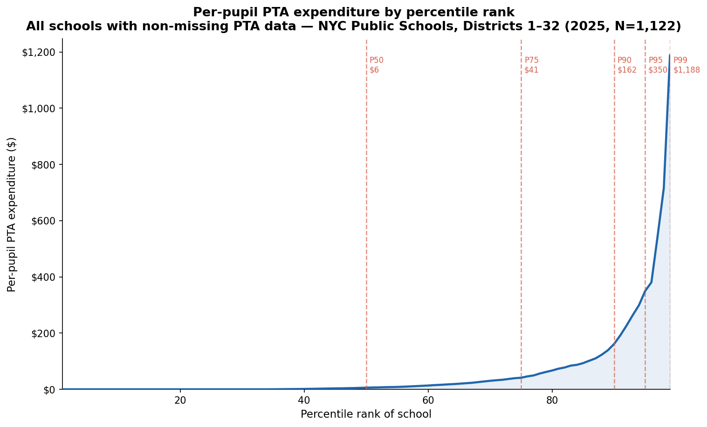 
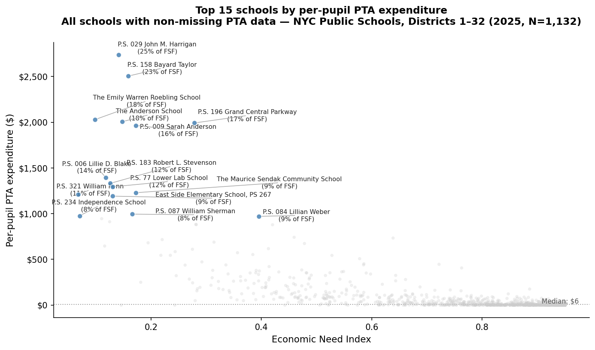

<!-- for PDF rendering with Quarto -->

<!-- {width=80%}
\newline
\par
{width=80%} -->

In the schools with the wealthiest PTAs, this expenditure acted almost as like a "shadow budget." For example, schools like P.S. 029 John M. Harrigan and P.S. 158 Bayard Taylor — which ranked 1st and 2nd in per-pupil PTA expenditures — spent private PTA funds worth 25% and 23% of their entire public FSF allocation, respectively.

### Socioeconomic and demographic stratification

As expected, schools serving students with more economic need tend to have PTAs that spend less.

There is a clear negative linear relationship (OLS slope = -6.81) between students' economic need
(measured by the NYCPS-created Economic Need Index, or ENI) and (the log of) PTA funding:

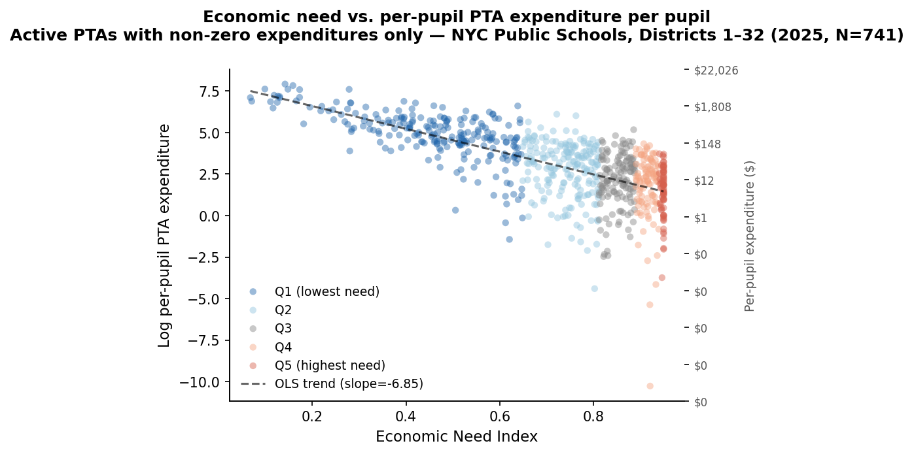

<!-- {width=80% fig-pos="H"} -->

Schools in the highest PTA expenditure quantile have a drastically higher share of White and Asian students compared to the lowest quantile, which is predominantly composed of Hispanic and Black students.

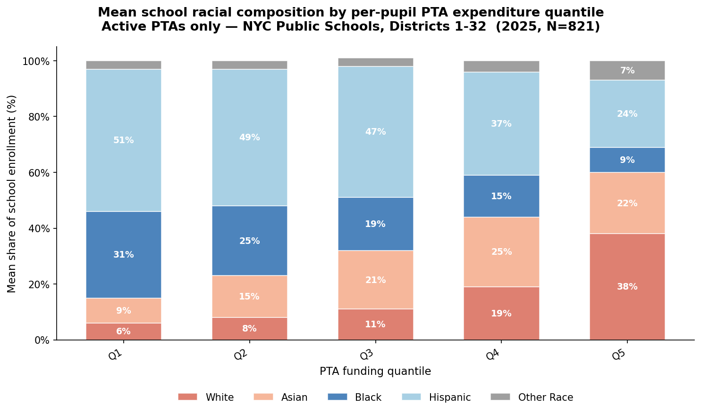

Among schools in the highest quintile (by per-pupil PTA expenditure), 60% of students were White or Asian and 33% were Black or Hispanic. However, among schools in the lowest quintile, just 15% were White or Asian, and 82% were Black or Hispanic.

<!-- {width=80% fig-pos="H"} -->

#### Caveat: comparison with total funding amounts

An important caveat to note is that generally, schools with greater need (serving students with more economic need, in greater need of special education services, etc.) receive _more_ in public funding (both in Fair Student Funding allocations and non-FSF allocations):

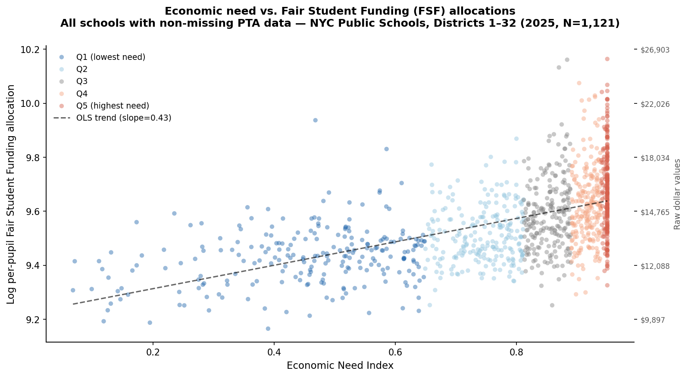 
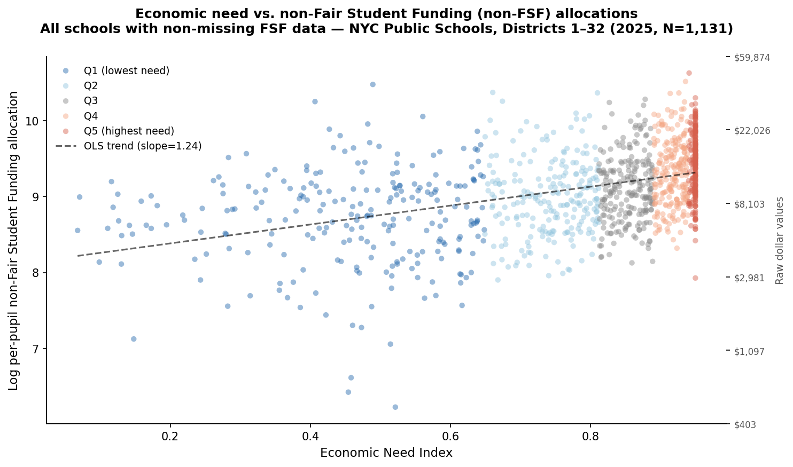

Additionally, even including PTA expenditures, schools in the lowest economic need quintile (Q1) receive less in total funding (FSF allocations + non-FSF allocations + PTA expenditures) compared to those in the higher quintiles:

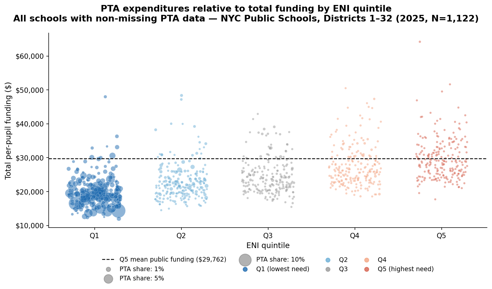

This indicates that PTA expenditures do not fully offset the redistributive design of public school funding: schools in the lowest-need quintile (Q1) still receive less in total funding than higher-need quintiles even after PTA dollars are included. However, as alluded to above, among the schools with the highest PTA expenditures, PTA dollars can comprise a significant share of total funding amounts—which may work against the equity imperative that public dollars are intended to enforce.

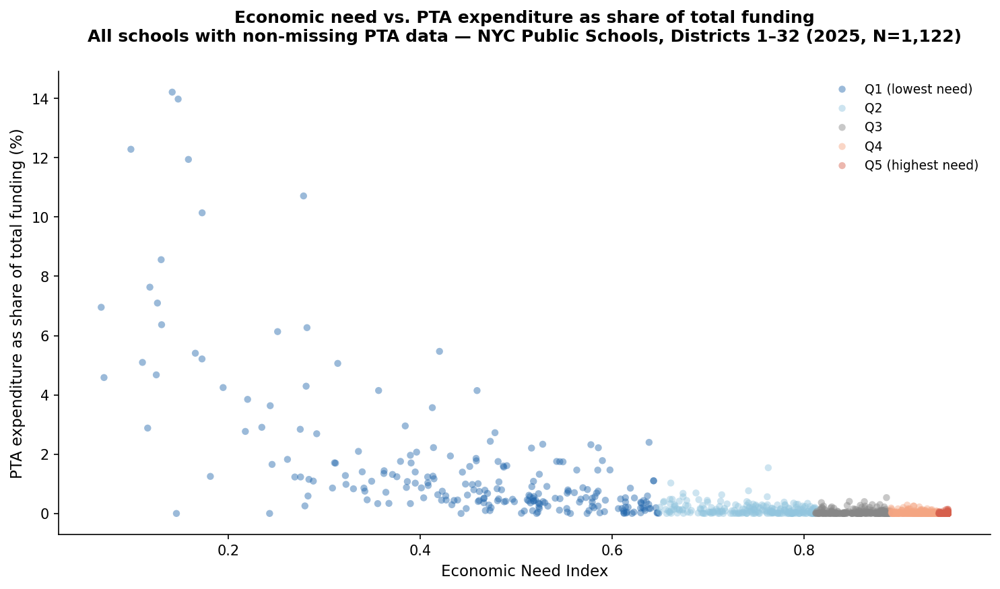

### Increasing inequity over time

As demonstrated below, the gap between the 20% of schools with the lowest economic need (Q1) and the remaining 80% (Q2-Q5) is stark and is widening.
And although PTA incomes and expenditures for the top quintile of schools by ENI dipped sharply during the pandemic, their _ending balances_—i.e., the money that the PTA carries over year-to-year—continued to steadily increase, suggesting that these PTAs are _accumulating_ wealth over time.

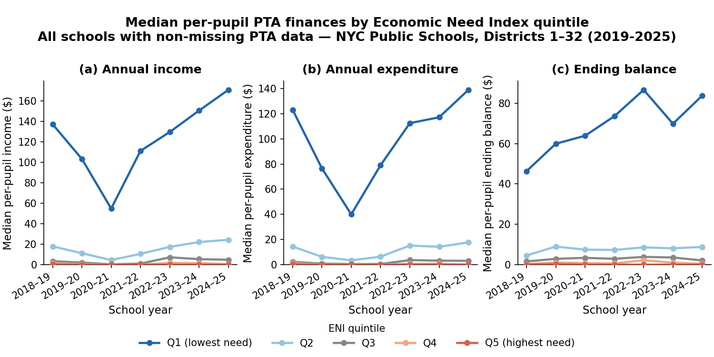

<!-- {fig-pos="H"} -->

### Data anomalies

The publicly available PTA fundraising data had a substantial number of accounting anomalies, such as:

- Cross-year discrepancies between ending balances in Y0 and starting balances in Y1.
- Within-year discrepancies between the implied ending balance (`starting balance + income - expenditures`), and the reported ending balance.
- Accounting errors like values expressed in cents rather than dollars.

In particular, the cross-year balance discrepancies - where the previous year's ending balance differed from the starting balance by over both 5% of the starting balance, and a raw amount of $50,000\* - were highly concentrated in the schools with the wealthiest PTAs. A possible cause could be that heavily funded PTAs handle more complex balance sheets (and larger rollover amounts) than less funded PTAs, meaning they are structurally more susceptible to bookkeeping variances than a school handling a few hundred dollars. Regardless, this may warrant more investigation to further characterize the nature of these discrepancies.

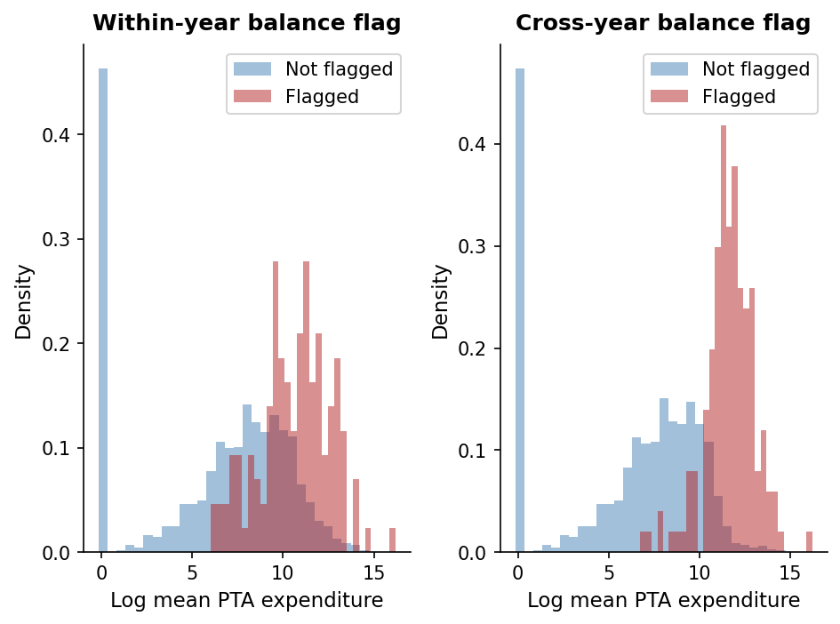
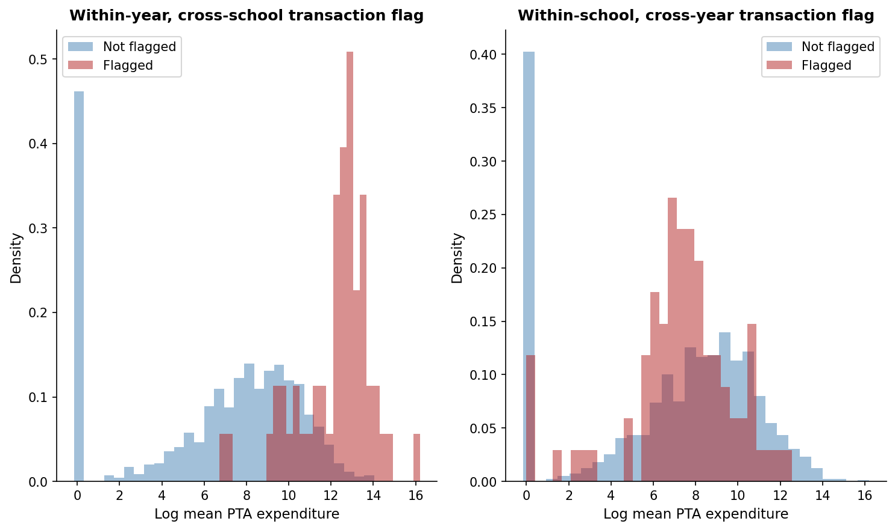

<!-- {width=80% fig-pos="H"}
\newline
\par
{width=80% fig-pos="H"} -->

## AI Use Disclaimer

This project was developed with assistance from Claude. Particularly,

- Initial conversations with Claude helped shape the research question, data architecture, and analytical approach, including the identification of methodological considerations like the treatment of missing vs. inactive PTA records.
- Claude also flagged several data quality issues during exploratory analysis, including an anomalous expenditure value that prompted a broader audit of balance sheet consistency. The systematic diagnosis and correction of scaling errors in PTA financials was developed collaboratively.
- Claude helped me scaffold analytical code, especially for the data visualization module. All generated code was reviewed, tested, and modified by myself before use.
- Finally, Claude provided feedback on descriptive outputs and figures during the exploratory analysis phase, helping prioritize which findings to foreground.
